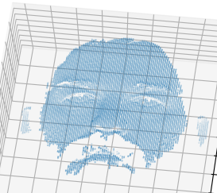
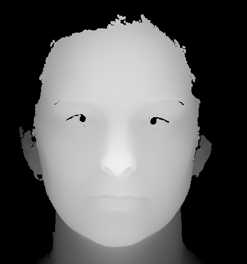

# Practice for 3D object projection
Try to project a 3D object to difference views.  
You can use any method to impliment this practice.  

## Description
3D objects are usually stored as "point cloud", which sample lots of dots along the surface of real world object and represent them as (x,y,z) in camera coordinate.[(wiki)](https://en.wikipedia.org/wiki/Point_cloud)  

The 3D object processing often lead to large amount of computation. To make this more efficiency and easy to display, we usually project them to 2D. [Here](https://arxiv.org/pdf/1505.00880.pdf) is an example  

## File explain:
The 3D object is store as XXX.abs file.(due to license, I cannot put here)  

The abs folder is a decoder for abs format.  
The CMake can generate a dynamic link libaray (dll) for other language or other platform.  

The python folder is a demo for use dll library.  

## GOAL
#### 1. Display Original point cloud in 3D space (Need a good cpu or gpu, if your device cannot display you can skip it)

#### 2. Project to 2D image (depth map)

#### 3. Try to rotate (any direction) the object and project it to 2D depth map. The output depth map should contain the rotation information(ex: £cx, £cy, £cz).